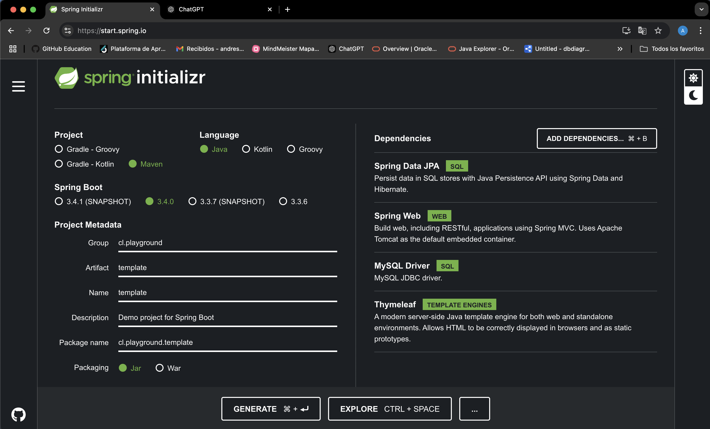

# Guía para plantilla Springboot

## Índice
1. [Sprint Initializer](#1-sprint-initializer)
2. [Estructura de Archivos](#2-estructura-de-archivos)
3. [Dependencias del Proyecto](#3-dependencias-pomxml)
4. [Creación de Base de Datos MySQL](#4-creacion-de-base-de-datos-mysql)
5. [Configuración de Base de Datos](#5-configuracion-de-base-de-datos-applicationproperties)

---

## 1. Spring Initializer


---

## 2. Estructura de Archivos
```plaintext
template
 ┣ .idea
 ┃ ┣ .gitignore
 ┃ ┣ compiler.xml
 ┃ ┣ encodings.xml
 ┃ ┣ jarRepositories.xml
 ┃ ┣ misc.xml
 ┃ ┣ vcs.xml
 ┃ ┗ workspace.xml
 ┣ .mvn
 ┃ ┗ wrapper
 ┃ ┃ ┗ maven-wrapper.properties
 ┣ src
 ┃ ┣ main
 ┃ ┃ ┣ java
 ┃ ┃ ┃ ┣ algoritmo
 ┃ ┃ ┃ ┗ cl
 ┃ ┃ ┃ ┃ ┗ playground
 ┃ ┃ ┃ ┃ ┃ ┗ template
 ┃ ┃ ┃ ┃ ┃ ┃ ┗ TemplateApplication.java
 ┃ ┃ ┗ resources
 ┃ ┃ ┃ ┣ query
 ┃ ┃ ┃ ┃ ┗ query.sql
 ┃ ┃ ┃ ┣ static
 ┃ ┃ ┃ ┣ templates
 ┃ ┃ ┃ ┗ application.properties
 ┃ ┗ test
 ┃ ┃ ┗ java
 ┃ ┃ ┃ ┗ cl
 ┃ ┃ ┃ ┃ ┗ playground
 ┃ ┃ ┃ ┃ ┃ ┗ template
 ┃ ┃ ┃ ┃ ┃ ┃ ┗ TemplateApplicationTests.java
 ┣ .gitattributes
 ┣ .gitignore
 ┣ HELP.md
 ┣ README.md
 ┣ mvnw
 ┣ mvnw.cmd
 ┗ pom.xml
```

## 3. Dependencias (pom.xml)
```xml
<dependencies>
    <!-- Starter para JPA y persistencia de datos -->
    <dependency>
        <groupId>org.springframework.boot</groupId>
        <artifactId>spring-boot-starter-data-jpa</artifactId>
    </dependency>

    <!-- Driver para conectar a bases de datos MySQL -->
    <dependency>
        <groupId>com.mysql</groupId>
        <artifactId>mysql-connector-j</artifactId>
        <scope>runtime</scope>
    </dependency>

    <!-- Starter para integración con Thymeleaf (motor de plantillas) -->
    <dependency>
        <groupId>org.springframework.boot</groupId>
        <artifactId>spring-boot-starter-thymeleaf</artifactId>
    </dependency>

    <!-- Starter para construir aplicaciones web (servlets y controladores REST) -->
    <dependency>
        <groupId>org.springframework.boot</groupId>
        <artifactId>spring-boot-starter-web</artifactId>
    </dependency>
</dependencies>

```

---

### **Explicación de las dependencias**

#### **spring-boot-starter-data-jpa**
- **Uso:**  
  Esta dependencia incluye todas las librerías necesarias para trabajar con **Java Persistence API (JPA)**, una especificación que facilita la interacción con bases de datos relacionales.  
  En Spring Boot, se utiliza junto con **Hibernate** (el proveedor de JPA por defecto) para realizar operaciones **CRUD** (Create, Read, Update, Delete) sobre la base de datos.

- **Beneficio:**  
  Simplifica el acceso a los datos y permite trabajar con **entidades** y **repositorios** sin escribir consultas SQL manualmente. Además, permite el uso de **anotaciones** para mapear tablas y columnas.


#### **mysql-connector-j**
- **Uso:**  
  Es el **driver de conexión** que permite a la aplicación comunicarse con una base de datos **MySQL**. Sin este conector, la aplicación no podrá interactuar con la base de datos.

- **Beneficio:**  
  Facilita la conexión entre la aplicación y MySQL, permitiendo ejecutar consultas y persistir datos en la base de datos.  
  La configuración se realiza fácilmente en el archivo `application.properties`.


#### **spring-boot-starter-thymeleaf**
- **Uso:**  
  Proporciona soporte para **Thymeleaf**, un **motor de plantillas** que permite crear páginas **HTML dinámicas** en aplicaciones web. Se integra perfectamente con **Spring Boot**.

- **Beneficio:**  
  Permite separar la lógica de la aplicación del diseño de las vistas, facilitando la creación de **interfaces de usuario amigables**. Thymeleaf es compatible con **HTML5** y se enfoca en ser intuitivo y fácil de aprender.


#### **spring-boot-starter-web**
- **Uso:**  
  Incluye todas las dependencias necesarias para desarrollar **aplicaciones web** y **servicios REST**. Contiene el servidor **Tomcat** integrado, por lo que no es necesario configurarlo manualmente.

- **Beneficio:**  
  Simplifica la creación de aplicaciones web y servicios **RESTful**, proporcionando soporte para **controladores** (`@Controller`, `@RestController`), mapeo de rutas (`@RequestMapping`) y manejo de peticiones **HTTP**.

---

### 4. Creacion de base de datos MySQL
```sql
CREATE DATABASE nombreBD;
USE nombreBD;
```

---


### 5. Configuración de Base de Datos (application.properties)**

```properties
spring.application.name=template

spring.datasource.url=jdbc:mysql://localhost:3306/template
spring.datasource.username=root
spring.datasource.password=1234
spring.jpa.hibernate.ddl-auto=update
spring.jpa.show-sql=true
spring.jpa.properties.hibernate.format_sql=true
```

---

#### **`spring.application.name`**
- **Función:**  
  Define el **nombre de la aplicación** dentro del contexto de Spring. Aunque no tiene impacto directo en la base de datos, se utiliza para identificar la aplicación en logs, métricas o configuraciones externas.

- **Beneficio:**  
  Facilita la identificación de la aplicación cuando se ejecutan múltiples servicios o al integrarse con herramientas de monitoreo.

---

#### **`spring.datasource.url`**
- **Función:**  
  Especifica la **URL de conexión** a la base de datos.  
  El formato general es:
  ```plaintext
  jdbc:mysql://<host>:<puerto>/<nombre-de-la-base-de-datos>
  ```  
  En este caso, `localhost` es la dirección del servidor, `3306` es el puerto predeterminado de MySQL, y `template` es el nombre de la base de datos.

- **Beneficio:**  
  Permite que la aplicación sepa **dónde conectar** y **qué base de datos utilizar**.

---

#### **`spring.datasource.username`**
- **Función:**  
  Define el **nombre de usuario** necesario para acceder a la base de datos.

- **Beneficio:**  
  Garantiza una conexión autorizada a la base de datos MySQL. En este caso, el usuario predeterminado es `root`.

---

#### **`spring.datasource.password`**
- **Función:**  
  Especifica la **contraseña** asociada al nombre de usuario configurado.

- **Beneficio:**  
  Proporciona una autenticación segura para conectar a la base de datos.

---

#### **`spring.jpa.hibernate.ddl-auto`**
- **Función:**  
  Controla el comportamiento de **Hibernate** respecto a la creación y actualización de las tablas en la base de datos.  
  Los valores comunes son:
    - `update`: Actualiza la estructura de las tablas sin borrar datos existentes.
    - `create`: Crea las tablas desde cero cada vez (¡borrando los datos!).
    - `create-drop`: Crea las tablas al iniciar y las elimina al cerrar la aplicación.
    - `none`: No realiza ninguna acción.

- **Beneficio:**  
  Facilita el desarrollo al actualizar automáticamente la estructura de la base de datos conforme a las entidades del proyecto.  
  En este caso, el valor `update` asegura que cualquier cambio en las entidades **JPA** se refleje en la base de datos sin perder datos existentes.

---

#### **`spring.jpa.show-sql`**
- **Función:**  
  Habilita la **visualización de las consultas SQL** ejecutadas por Hibernate en la consola.

- **Beneficio:**  
  Ayuda a los desarrolladores a **depurar** y entender las operaciones que realiza Hibernate en la base de datos.

---

#### **`spring.jpa.properties.hibernate.format_sql`**
- **Función:**  
  Formatea las consultas SQL mostradas en la consola para que sean **más legibles**.

- **Beneficio:**  
  Mejora la **claridad** del SQL generado por Hibernate al mostrarlo con saltos de línea y sangrías. Esto facilita la depuración y análisis de las consultas.